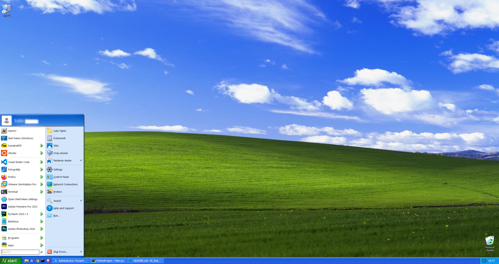
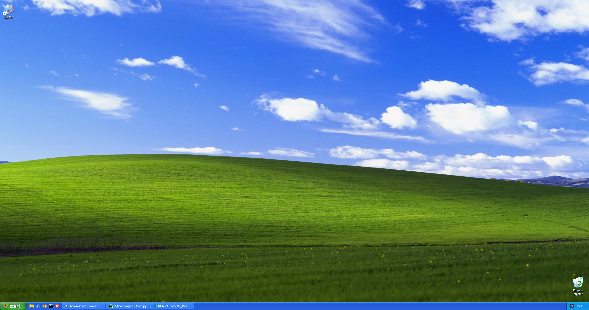
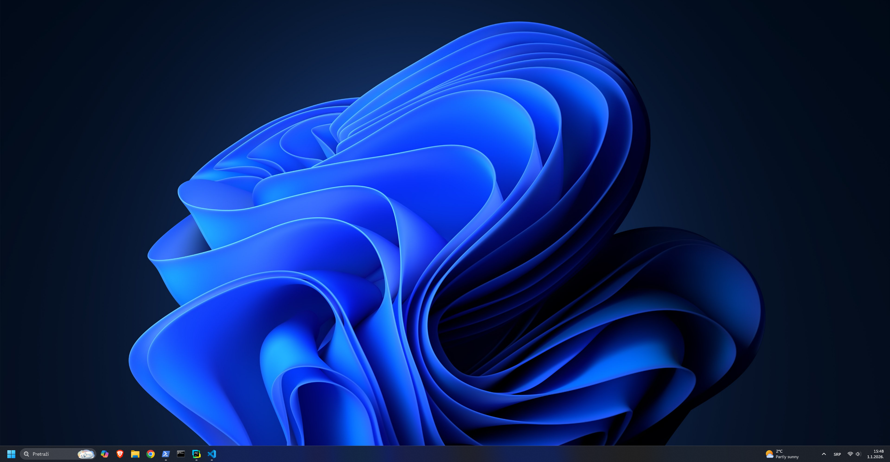

# Windows XP Theme for Windows 11

> **My first project of 2026!** 🎉  
> Created on January 1st, 2026

Relive the nostalgia of Windows XP on your Windows 11 machine. This theme transformation brings back the classic Bliss wallpaper, Luna Blue colors, iconic sounds, and that familiar XP feel—all while keeping Windows 11's modern kernel and functionality intact.


---

## 📋 Table of Contents

- [Features](#-features)
- [What Gets Changed](#-what-gets-changed)
- [What Stays the Same](#-what-stays-the-same)
- [Installation](#-installation)
- [Usage](#-usage)
- [Included Assets](#-included-assets)
- [Third-Party Tools](#-third-party-tools)
- [Screenshots](#-screenshots)
- [Troubleshooting](#-troubleshooting)
- [Contributing](#-contributing)
- [License](#-license)
- [Acknowledgments](#-acknowledgments)

---

## ✨ Features

- **One-click installation** via PowerShell scripts or the easy launcher menu
- **Complete visual transformation** to Windows XP Blue theme
- **Automatic backup system** - all your Windows 11 settings are safely backed up
- **100% reversible** - restore Windows 11 anytime with one click
- **30-second test mode** - try it out before committing
- **500+ authentic Windows XP icons** (Desktop, System, Applications, Files)
- **Classic XP sounds** (startup, shutdown, error sounds)
- **Bliss wallpaper** in high resolution (1920x1080)
- **Safe design** - no system files modified, no kernel changes
- **RetroBar integration** - authentic XP-style taskbar
- **OpenShell support** - classic XP Start Menu

---

## 🎨 What Gets Changed

### Visual Elements
- Desktop wallpaper → Windows XP Bliss
- Window colors → XP Luna Blue theme
- System colors → Classic XP palette (26 colors)
- Mouse cursor → XP default cursor
- Desktop icons → My Computer, Recycle Bin, My Documents, Network
- Taskbar appearance → Classic XP styling (with RetroBar)
- Start Menu → Classic two-column menu (with OpenShell)

### Audio
- System startup sound → Windows XP startup
- Shutdown sound → XP shutdown melody
- Logout sound → XP logout chime
- Error/exclamation sounds → Classic XP alerts
- Default system beep → XP notification sound

### System Settings
- Transparency effects → Disabled (authentic XP look)
- Visual effects → Optimized for performance
- Window animations → XP-style fade
- Context menu → Classic right-click menu
- Rounded corners → Disabled (Windows 11 specific)

---

## 🛡️ What Stays the Same

**This theme only changes the UI, not the kernel or system files.**

- ✅ Windows 11 kernel and core system
- ✅ Security features (Windows Defender, Firewall)
- ✅ Windows Update functionality
- ✅ All installed applications
- ✅ User files and data
- ✅ Network settings
- ✅ Hardware drivers
- ✅ Modern Windows 11 features (WSL, Hyper-V, etc.)
- ✅ System stability and performance

**Important:** This works on **activated Windows installations only**. We respect Microsoft's licensing.

---

## 📦 Installation

### Prerequisites

- Windows 11 (any edition - Home, Pro, Enterprise, Education)
- Administrator privileges
- 50 MB free disk space
- PowerShell 5.1+ (included in Windows 11)

### Quick Start

1. **Download** the latest release (`src.zip`)
2. **Extract** the archive to any folder
3. **Right-click** `START_HERE.bat` and select **"Run as Administrator"**
4. Follow the on-screen menu

### Detailed Steps

**Option 1: Using the Launcher (Easiest)**

```batch
# Navigate to extracted folder
cd path\to\extracted\folder

# Run the launcher as Administrator
START_HERE.bat
```

Choose from the menu:
- `[0]` Convert icons (PNG → ICO) - **Run this first!**
- `[1]` Test theme (30 seconds, auto-restore) - **Recommended**
- `[2]` Apply theme permanently
- `[3]` Restore Windows 11 default
- `[4]` Configure OpenShell (Classic Start Menu)
- `[5]` Stop RetroBar only

**Option 2: PowerShell Direct**

```powershell
# Test for 30 seconds (recommended first)
.\run-test.ps1

# Apply permanently
.\run.ps1

# Restore Windows 11
.\back_to_win11.ps1
```

**Option 3: Manual PowerShell**

```powershell
# Open PowerShell as Administrator
# Navigate to folder
cd path\to\extracted\folder

# Run test mode
.\run-test.ps1
```

### First-Time Setup

If you get an "Execution Policy" error:

```powershell
Set-ExecutionPolicy RemoteSigned -Scope CurrentUser
```

Type `Y` and press Enter, then try again.

---

## 🚀 Usage

### Testing Before Applying

**Highly recommended for first-time users:**

```powershell
.\run-test.ps1
```

This will:
1. Apply the Windows XP theme
2. Let you experience it for 30 seconds
3. Automatically restore Windows 11
4. No manual intervention needed

Perfect for deciding if you like it!

### Applying the Theme

Once you're ready:

```powershell
.\run.ps1
```

What happens:
- Backup created automatically (`Backup_Win11/` folder)
- Wallpaper, colors, cursor, and sounds applied
- Icons configured (converted to ICO format)
- RetroBar started (if available)
- OpenShell started (if installed)
- Explorer restarted

**Note:** A full restart is recommended for complete effect.

### Converting Icons

Before applying the theme, convert the PNG icons to ICO format:

**High-Quality Python Converter (Recommended):**

```batch
RUN_ICON_CONVERTER.bat
```

Requirements: Python 3.7+ with Pillow

```bash
pip install -r requirements.txt
```

**PowerShell Converter (Faster, lower quality):**

```powershell
.\convert_all_icons.ps1
```

### Restoring Windows 11

To revert all changes:

```powershell
.\back_to_win11.ps1
```

This will:
- Restore all settings from backup
- Revert wallpaper, colors, cursor, sounds
- Stop RetroBar and OpenShell
- Restore Windows 11 taskbar
- Re-enable transparency and modern features

Your backup is preserved for future use.

### Icon Configuration

After applying the theme, you can manually configure additional icons:

```powershell
.\install_icons.ps1
```

This creates:
- `WindowsXP_Icons/` folder with all icons
- `ICON_INSTALLATION_GUIDE.txt` with instructions
- Registry entries for desktop icons

---

## 📂 Included Assets

### Directory Structure

```
XP_Reantimation/
├── Boot/
│   └── WindowsXP_Boot.gif        # XP boot animation (38.7 KB)
├── cursor/
│   └── cursor.cur                # XP default cursor (0.32 KB)
├── Icons/                        # 501 PNG icons (~2 MB)
│   ├── My Computer.png
│   ├── Recycle Bin (empty).png
│   ├── My Documents.png
│   └── ... (498+ more icons)
├── Icons_ICO/                    # Converted ICO icons
│   └── (generated by converter)
├── Logo/
│   ├── WinXP_Logo.png
│   └── WinXP_Logo2.png
├── OpenShell/                    # OpenShell files (if installed)
├── Retro_Bar/
│   └── RetroBar.exe              # Place here or download
├── Sounds/
│   ├── WindowsXP_Startup.mp3    # 77.8 KB
│   ├── windows-xp-log-out.mp3   # 24.5 KB
│   ├── WindowsXP_shutdown.mp3
│   ├── WindowsXP_error.mp3
│   └── windows_xp_404_error.mp3
├── Wallpaper/
│   └── Windows_XP_Wallpaper.png # Bliss (6.7 MB, 1920x1080)
├── Backup_Win11/                 # Auto-generated backup
├── run.ps1                       # Main installer
├── back_to_win11.ps1             # Restoration script
├── run-test.ps1                  # 30-second test mode
├── apply_icons.ps1               # Icon applier
├── install_icons.ps1             # Icon installer helper
├── convert_all_icons.ps1         # PowerShell icon converter
├── convert_icons_hq.py           # Python HQ icon converter
├── configure_openshell.ps1       # OpenShell configurator
├── configure_retrobar.ps1        # RetroBar configurator
├── configure_retrobar_auto.py    # Python RetroBar auto-config
├── stop_retrobar.ps1             # Stop RetroBar
├── START_HERE.bat                # Easy launcher menu
├── RUN_ICON_CONVERTER.bat        # Icon converter launcher
├── RUN_RETROBAR_CONFIG.bat       # RetroBar config launcher
├── requirements.txt              # Python dependencies
├── README.txt                    # Text documentation
├── INSTALLATION.txt              # Installation guide
├── FEATURES.txt                  # Feature list
├── PROJECT_INFO.txt              # Project details
├── OPENSHELL_GUIDE.txt           # OpenShell guide
└── README_RETROBAR.txt           # RetroBar guide
```

### Asset Details

**Boot Screen:**
- `WindowsXP_Boot.gif` - Classic XP boot animation
- Requires HackBGRT (third-party tool) for boot screen replacement

**Cursor:**
- `cursor.cur` - Windows XP default arrow cursor
- Applied automatically

**Icons (501 files):**
- Desktop icons (My Computer, Recycle Bin, My Documents, Network)
- System tools (Control Panel, Settings, Properties)
- Applications (IE, Media Player, Notepad, Paint, Calculator)
- File types (Documents, images, archives, executables)
- Hardware (Drives, devices, printers)
- Network (Connections, sharing)
- Actions (Copy, paste, delete, search)

**Sounds:**
- Authentic Windows XP system sounds
- MP3 format for compatibility
- Total size: ~100 KB

**Wallpaper:**
- The legendary "Bliss" photograph
- High resolution: 1920x1080
- Original colors preserved

---

## 🔧 Third-Party Tools

This theme integrates with third-party tools for the complete XP experience.

### RetroBar (Windows XP Taskbar)


**Author:** [dremin](https://github.com/dremin)  
**License:** Apache License 2.0  
**Download:** [RetroBar Releases](https://github.com/dremin/RetroBar/releases)

RetroBar brings back the classic Windows XP taskbar.

**Setup:**
1. Download `RetroBar.exe` from the releases page
2. Place in `Retro_Bar/` folder
3. Run the theme installer - RetroBar starts automatically
4. Configured for "Windows XP Blue" theme

**Features:**
- Classic XP Blue taskbar styling
- Start button with XP appearance
- System tray with XP look
- Clock display
- Quick launch support

**Manual Configuration:**

```powershell
.\configure_retrobar.ps1
```

Or use Python auto-configurator:

```batch
RUN_RETROBAR_CONFIG.bat
```

### OpenShell (Classic Start Menu)


**Author:** [Open-Shell Team](https://github.com/Open-Shell)  
**License:** MIT License  
**Download:** [OpenShell Releases](https://github.com/Open-Shell/Open-Shell-Menu/releases)

OpenShell replaces the Windows 11 Start Menu with a classic XP-style menu.

**Installation:**
1. Download and install OpenShell from GitHub
2. Choose "Classic with two columns" style
3. Select Windows XP skin
4. Our scripts automatically detect and start OpenShell

**Features:**
- Classic two-column Start Menu
- User picture display
- Programs, Documents, Settings, Search, Run
- Customizable skins and themes
- XP-style animations

**Manual Configuration:**

```powershell
.\configure_openshell.ps1
```

### HackBGRT (Boot Screen - Optional)

**Author:** Metabolix  
**Download:** [HackBGRT](https://github.com/Metabolix/HackBGRT)

For changing the boot screen to Windows XP animation.

**Note:** Boot screen modification requires UEFI systems and careful configuration. See the HackBGRT documentation for details.

---

## 📸 Screenshots





---

## 🐛 Troubleshooting

### Common Issues

**Scripts won't run:**
```powershell
# Fix execution policy
Set-ExecutionPolicy RemoteSigned -Scope CurrentUser
```

**Not running as Administrator:**
- Right-click the script → "Run as Administrator"
- Or use the `START_HERE.bat` launcher

**Changes not visible:**
- Restart your computer for full effect
- Run `.\back_to_win11.ps1` then `.\run.ps1` again

**Icons not changing:**
1. Run `.\convert_all_icons.ps1` first
2. Then run `.\apply_icons.ps1`
3. Restart Explorer or log out/in

**Taskbar auto-hide bug:**
- The restoration script now properly fixes this
- Manual fix: Settings → Personalization → Taskbar → Auto-hide

**RetroBar not starting:**
- Download from [RetroBar Releases](https://github.com/dremin/RetroBar/releases)
- Place `RetroBar.exe` in `Retro_Bar/` folder
- Run `.\configure_retrobar.ps1`

**OpenShell not starting:**
- Install from [OpenShell Releases](https://github.com/Open-Shell/Open-Shell-Menu/releases)
- Configure for "Classic with two columns"
- Run `.\configure_openshell.ps1`

**Antivirus blocking:**
- Temporarily disable antivirus
- Scripts are safe (check the source code)
- Add exception for the folder

**Python not found (for HQ icon converter):**
```bash
# Install Python 3.7+
# Download from python.org
# Then install dependencies
pip install -r requirements.txt
```

### Getting Help

If you encounter issues:

1. Check the troubleshooting sections in `README.txt`
2. Review the `INSTALLATION.txt` guide
3. Open an issue on GitHub with details:
   - Windows 11 version
   - Error messages
   - Steps to reproduce

---

## 🤝 Contributing

This is my first project of 2026, and I'd love your contributions!

### How to Contribute

1. **Fork** the repository
2. **Create** a feature branch (`git checkout -b feature/amazing-feature`)
3. **Commit** your changes (`git commit -m 'Add amazing feature'`)
4. **Push** to the branch (`git push origin feature/amazing-feature`)
5. **Open** a Pull Request

### Ideas for Contributions

- Additional Windows XP themes (Silver, Olive Green)
- More icon packs
- Improved icon conversion quality
- Additional sound schemes
- Start Menu skin variations
- Documentation improvements
- Translations

---

## 📄 License

This project is licensed under the **MIT License** - see the [LICENSE](LICENSE) file for details.

### What this means:
- ✅ Free to use for personal purposes
- ✅ Free to modify and distribute
- ✅ Free to use commercially
- ⚠️ Provided "as is" without warranty

---

## 🙏 Acknowledgments

### Third-Party Tools

This project integrates with and acknowledges:

- **[RetroBar](https://github.com/dremin/RetroBar)** by dremin
  - License: Apache License 2.0
  - Classic Windows taskbar replacement
  - Used for authentic XP taskbar experience

- **[OpenShell](https://github.com/Open-Shell/Open-Shell-Menu)** by Open-Shell Team
  - License: MIT License
  - Classic Start Menu implementation
  - Provides the XP-style Start Menu

### Microsoft

We respect Microsoft and their intellectual property:
- Windows XP and Windows 11 are trademarks of Microsoft Corporation
- This is a fan-made customization tool for personal use
- Works only on **activated Windows installations**
- **Does not modify system files or kernel** - only UI changes
- Educational and nostalgic purposes only

### Assets

- Windows XP icons, sounds, and visual elements are property of Microsoft
- Bliss wallpaper © Charles O'Rear / Microsoft
- This project is for personal customization and nostalgia purposes

### Special Thanks

- The Windows XP design team at Microsoft (2001)
- The open-source community for RetroBar and OpenShell
- Everyone who contributed feedback and testing
- The Windows enthusiast community

---

## 📝 Notes

### Project Background

This is **my first project of 2026**, created on **January 1st, 2026**. I wanted to bring back the nostalgia of Windows XP to modern Windows 11 systems while maintaining full system functionality and safety.

### Philosophy

- **Safety first:** No kernel modifications, no system file changes
- **Reversible:** Always provide a way back
- **User-friendly:** Easy installation for everyone
- **Respect:** Honor Microsoft's licensing and third-party authors

### Future Plans

- Additional XP themes (Silver, Olive Green, Royale)
- More comprehensive boot screen support
- Enhanced icon pack with more variations
- Automated updates for RetroBar and OpenShell
- Community-contributed themes and skins

---

## 🌟 Star This Project

If you enjoy this Windows XP theme, please **star** this repository! ⭐

It helps others discover the project and motivates continued development.

---

## 📧 Contact

Found a bug? Have a suggestion? Want to contribute?

- **GitHub Issues:** [Open an issue](https://github.com/Luka12-dev/Windows-XP-Theme/issues)
- **Pull Requests:** Always welcome!

---

<div align="center">

**Made with ❤️ and nostalgia**

*Relive the golden age of Windows XP on Windows 11*

[⬆ Back to Top](#windows-xp-theme-for-windows-11)

</div>